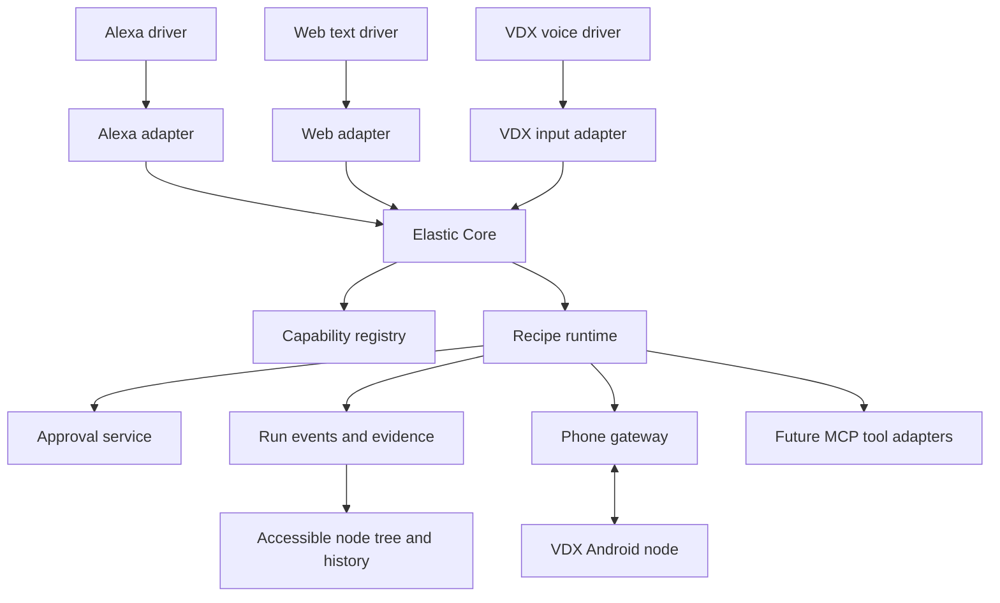
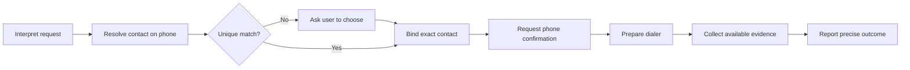

# Elastic: Application Design Document

> **5 October 2026 revision:** The current platform is Expo/React Native for iOS and Android together. The team consists of agent workstreams. Own-app tap-to-talk is the primary voice entry; Alexa is optional. [Expo and voice decision](Elastic-Expo-and-Voice-Decision.md) supersedes conflicting Android-only, Alexa sequencing, human staffing and schedule assumptions below. Unchanged Core, approval and evidence requirements still apply.

Version 0.1 · 3 October 2026 · Proposed implementation baseline

## 1. Purpose and status

Elastic lets a person request a task through a voice or text interface, coordinates the capabilities needed to perform it, and shows what happened in a live node tree. VDX is the Android execution node. Alexa is an optional voice driver, connected through an adapter.

This document proposes the first implementation. It is not evidence that the architecture already exists. It does not authorize deployment, account changes, or merging existing pull requests. Estimates and platform integrations require validation against the current code and target devices.

The initial audience is blind and low-vision Android users. The web interface also gives the user a readable execution history. Caregiver access is not implicit and is outside the first release.

## 2. Product outcome

A user can ask Elastic to prepare a call to a saved contact. Elastic resolves the person, presents the exact proposed action for confirmation, and asks the paired VDX node to open the correct dialer screen. The execution view reports the result supported by evidence.

Opening a dialer is not a connected call. The first release requires the user to press Call. Any future fully hands-free calling promise is a separate scope and platform decision.

Example interaction:

1. User: “Prepare a call to Papa.”
2. Elastic asks which contact if more than one matches.
3. Elastic: “Open the dialer for Papa, mobile ending 1234?”
4. User confirms on the paired phone.
5. VDX opens the dialer when Android permits it.
6. Elastic reports either the verified dialer state, the handoff it can establish, or an explicit failure/unverified outcome.

Remote requests must not assume that Android permits an immediate screen launch. Where required, VDX presents a notification and the user opens the app to continue.

## 3. Scope

### First end-to-end milestone

- One web text entry point and its adapter.
- Elastic Core with typed requests, a capability registry and one fixed recipe.
- One paired Android phone per user.
- Contact resolution, confirmation and dialer preparation.
- Persistent run events and an accessible live node-tree view.
- Offline, cancellation, expiration and restart handling.

### After that milestone

- Local voice input and spoken responses through VDX.
- Alexa adapter using the same request and run contracts, subject to a platform feasibility check.
- Additional capabilities, introduced individually: memory, message preparation, camera descriptions.
- MCP tool adapters for specifically approved tools and accounts.

### Outside the first release

- Autonomous payments or arbitrary app control.
- Guaranteed call connection or message delivery detection.
- TV control and media playback verification.
- General-purpose self-modifying recipes or automatic retries of consequential actions.
- A marketplace, multi-user delegation, or caregiver administration.
- Replacement of TalkBack.
- Mandatory Gemini Nano or cloud AI for basic calling.

## 4. Architecture



The runtime executes a directed acyclic graph for each recipe version. The UI may present it as a node tree. A graph is required because independent steps can branch and later join.

WebMCP, MCP and A2A are separate integration protocols. They should share internal envelopes where useful, but each requires its own permissions and lifecycle handling. Their presence in an architecture diagram does not make them implemented or interchangeable.

## 5. Ownership of responsibilities

| Component | Owns | Must not do |
|---|---|---|
| Driver | User interaction and response presentation | Invent execution results |
| Adapter | Validate and translate external requests; retain identity and request IDs | Bypass approval or grant permissions |
| Core | Intent normalization, clarification and capability selection | Treat model output as authority |
| Registry | Versioned capabilities, constraints, availability and evidence semantics | Assume an offline node is callable |
| Runtime | Dependencies, deadlines, durable state and recovery | Blindly repeat an uncertain action |
| Approval service | Specific, expiring approval bound to an action | Reuse approval for changed arguments |
| VDX | Local permissions, contact lookup, action execution and local evidence | Execute arbitrary remote code |
| Event store | Durable ordered run history | Store unnecessary contact or message content |
| Node Tree UI | Render state and evidence accessibly | Turn a dispatched request into success |

VDX may be both an input driver and an execution node. These roles remain separate so that requests from Alexa and requests from the phone use the same action policy.

## 6. Proposed technology baseline

- Keep the existing VDX Kotlin/Android codebase.
- Use TypeScript for the new core, protocol validation and web application, unless an existing Elastic implementation makes reuse preferable.
- Use PostgreSQL for users, devices, capabilities, approvals, runs and durable events.
- Run the initial coordinator and a small database-backed worker as a modular service; separate services only when operational needs justify them.
- Use React for the web interface, with an accessible ordered-list view alongside the graph.
- Stream browser updates through Server-Sent Events, with cursor-based replay after reconnect.
- Use authenticated HTTPS for phone registration, command retrieval and acknowledgements. Select push-assisted delivery or a foreground connection after testing Android lifecycle behaviour. Do not rely on a permanent background socket.
- Use versioned JSON schemas for all messages and generated contract tests across TypeScript and Kotlin.

This is a proposal, not a requirement to rewrite working components. The initial code audit must identify what can be reused.

## 7. Contracts

### Request envelope

Required fields: `schema_version`, `request_id`, `actor_id`, `source`, `source_request_id`, `utterance`, `locale`, `created_at` and optional `target_device_id`.

Actor identity comes from authenticated transport, never from a user-editable JSON field alone. Deduplicate repeated deliveries using the source and its request ID. Prefer structured requests over retaining raw audio.

### Intent IR

Required fields: `intent_id`, `verb`, `slots`, `unresolved_slots`, `parser_version` and `source_request_id`.

The first supported verb is `call.prepare`. A name such as “Papa” initially remains an unresolved label. Only the phone's contact resolver can turn it into an opaque contact reference. An AI model cannot manufacture a trusted contact ID.

An optional model can propose an intent, but its output must pass schema validation, an allowlist and normal clarification rules. A model confidence score is not proof that a recipient is correct.

### Capability manifest

Each capability declares:

- Stable name and version, input/output schemas and owning node.
- Required permissions and account scopes.
- Availability and supported locales.
- Whether it changes external state and requires confirmation.
- Timeout, retry classification and supported cancellation boundary.
- Evidence it can produce and the precise completion claim it supports.

Initial capabilities: `android.contacts.resolve`, `android.dialer.prepare`. Approval is a runtime control node, visible in the graph.

### Command envelope

Required fields: `command_id`, `run_id`, `step_id`, `device_id`, `capability_version`, `arguments`, `arguments_hash`, `approval_id` when required, `idempotency_key`, `issued_at`, `expires_at` and `attempt`.

The phone verifies authentication, target device, capability support, expiry and approval binding before execution. It records received commands durably so reconnects cannot create duplicate actions.

### Evidence envelope

Required fields: `evidence_id`, `run_id`, `step_id`, `command_id`, `producer`, `observed_at`, `evidence_type`, `assertion`, `verification_method` and optional redacted details.

Evidence classes include local API acceptance, observed UI state and downstream acknowledgement. These are not equivalent. A screenshot is optional diagnostic material, not the default proof mechanism.

## 8. Calling recipe and completion semantics



The core retains an opaque recipient reference and minimal display information. The phone resolves that reference to a number locally. Confirmed recipient and action arguments must not change between approval and execution.

Opening the dialer through `ACTION_DIAL` does not by itself establish that the screen appeared or that a call connected. During the platform spike, determine which observations are available without requesting extra accessibility access. If only dispatch is known, report “Dialer request handed to Android; opening not verified.” User confirmation may be recorded as user-reported evidence, not silently promoted to automated verification.

The first release must explicitly choose and test its supported completion claim. It must not add broad accessibility permissions merely to make the status indicator green.

## 9. Run state, recovery and the node tree

Step states: `pending`, `ready`, `running`, `waiting_for_user`, `waiting_for_device`, `succeeded`, `failed`, `cancelled`, `expired`, `unverified`, `skipped`.

`succeeded` means the step's declared postcondition is established. `unverified` means execution may have occurred but the required postcondition cannot be established. Run outcomes aggregate mandatory step results; partial completion remains visible.

Events include `run.created`, `step.started`, `approval.requested`, `approval.resolved`, `command.dispatched`, `command.acknowledged`, `evidence.recorded`, `step.finished` and `run.finished`. Each event has a stable ID and a monotonically increasing sequence within its run.

Persist state transitions and their outbound work transactionally, using an outbox pattern. Browser clients and phone nodes resume from acknowledged cursors. The UI projects events; it never controls the authoritative result.

Delivery may occur more than once. Do not promise exactly-once external effects. If a phone crashes after launching an action but before reporting it, reconcile its local journal and available observations. If the result remains uncertain, mark it unverified and ask the user before another attempt.

Cancellation stops pending work. An already opened dialer or sent message is not undone by cancelling the run. Explain any action already performed.

Initial proposed deadlines: clarification and approval expire after two minutes; stale action commands are never executed automatically when a phone reconnects. Tune deadlines through accessibility testing rather than making them rigid user-facing limits.

### UI requirements

- Every node shows its action, state, responsible device/tool, timing and available evidence.
- Edges show data dependencies; sensitive payloads are redacted.
- Provide a keyboard- and screen-reader-accessible list with the same information as the graph.
- Announce meaningful state changes without repeatedly interrupting the user.
- Use text and icons as well as colour.
- Keep approval controls specific: action, recipient and a clear cancel option.
- Provide a plain-language run summary and a diagnostic expansion.

## Node tree implementation — required in the first release

Added 5 October 2026. This section specifies proposed implementation, not code already built. It applies to the Expo iOS app, Expo Android app and web interface. A visual node tree is required on both mobile platforms; the accessible list complements it rather than replacing it.

### What the user sees

A run screen contains a plain-language request, current outcome, a Tree/Steps switch and cancellation when applicable. The Tree tab shows the actual recipe graph, with one node for each capability invocation and explicit control nodes for clarification and approval. Edges identify execution dependencies and data passed between steps. A capability used twice creates two distinct invocation nodes.

Example while waiting for confirmation:

```text
Prepare a call to Papa                 Waiting for you

[Understand request ✓]
          │ intent
[Find contact on this phone ✓]
          │ selected contact reference
[Confirm recipient ◷]  ← action needed
          │ approved action
[System calling handoff ·]
          │ handoff observation
[Report outcome ·]
```

The phone is the execution location shown on a node, not a replacement for its capability. A future recipe can branch into separate MCP capabilities and join when prerequisites complete. This is a dependency graph, even though the product calls it a node tree.

### Shared data model

Implement versioned schemas in `packages/contracts` and pure projection/layout logic in `packages/run-model`. These are proposed repository paths, to be reconciled with the code inventory.

| Entity | Required information |
|---|---|
| RunGraph | run ID, recipe ID/version, graph revision, nodes, edges, last event sequence |
| RunNode | stable step ID, kind (capability/control), label, capability/version if applicable, executor reference, declared completion condition |
| RunEdge | stable edge ID, source/target step IDs, dependency type, redacted data label; never raw contact/message values |
| NodeAttempt | attempt ID, step ID, command ID, status, timestamps, error code and evidence references |
| RunEvent | event ID, run ID, sequence, graph revision, event type, timestamp, typed payload |
| Evidence | producer, observation, method, timestamp, supported claim and redacted detail |

Keep recipe structure separate from run state and evidence. Retries add attempts under the original node rather than erasing history. Version the graph if the runtime changes its structure; the MVP uses fixed recipes. UI node IDs never depend on array positions or labels.

### State and evidence rules

Use the design's common states: pending, ready, running, waiting_for_user, waiting_for_device, succeeded, failed, cancelled, expired, unverified and skipped. Show a text label and icon as well as colour. Unknown/disconnected is not failure, and a dispatch acknowledgement is not action completion.

The runtime checks declared completion conditions and emits the authoritative result. The renderer never infers success from an animation or timeout. A handoff node may succeed at its explicitly defined handoff task while the overall screen still says that call connection is unknown. Do not display “Call completed” for either platform's calling handoff.

### Backend read and command interfaces

- `GET /runs/:id`: authorized graph snapshot plus state and an atomic event cursor.
- `GET /runs/:id/events?after=sequence`: ordered events after that cursor; replay supported.
- `GET /runs/:id/nodes/:stepId/evidence`: authorized, redacted evidence details.
- `POST /runs/:id/cancel`: request cancellation with request ID and expected run revision.
- `POST /runs/:id/approvals/:approvalId`: decision tied to expected revision and exact argument hash, accepted only on an authorized approval surface.

In the first release, phone confirmation remains authoritative. The web tree can explain “Confirm on your phone” without offering an unauthorized web approval. A changed action or stale approval receives a conflict/expiry response and fresh state; never assume that a button tap succeeded.

Use a common subscription abstraction: browser SSE and an Expo-compatible streaming transport selected by a short spike. Ordered cursor polling is the mobile fallback. Do not assume browser EventSource is available unchanged in React Native.

### Live projection and reconnection

1. Fetch snapshot and its cursor, then subscribe to later events so the snapshot/stream boundary loses no updates.
2. Validate event schema, run ID and graph revision.
3. Ignore already-applied sequences; detect gaps and request replay before advancing.
4. Apply each event through a deterministic reducer and update only affected nodes.
5. If replay history is unavailable or graph versions differ, reload a current snapshot.
6. On background/resume, reconnect from the cursor. Mark the view as disconnected and show last-updated time while stale.
7. Persist only redacted cached state; clear it on logout or device/account revocation as applicable.

The event store and authorization checks remain the source of truth. Local UI state cannot create approvals, rewrite evidence or trigger device actions.

### Expo and web rendering

Build shared `RunScreen`, `RunSummary`, `NodeCard`, `StatusBadge`, `NodeDetails`, `EvidencePanel`, `ApprovalPrompt` and `StepsView` components where platform rendering permits. Use platform-specific `GraphViewport` and `EdgeLayer` implementations behind the same graph model.

For MVP, use deterministic top-to-bottom layered layout: order by dependencies, place parallel nodes in lanes, and keep existing positions stable during status changes. Start with bounded fixed recipes; collapse completed groups for larger future graphs. Reject cycles in recipe validation. Do not implement free-form workflow editing or drag-to-rewire execution in this release.

Expo Tree view uses native node cards over a vector connector layer, with pan/zoom, fit-to-view and focus-current-step controls. Select a maintained Expo-compatible vector/gesture implementation in the platform spike; no untested library/version is treated as selected. Web can use its own graph renderer with the same positions and semantic model.

On phones, tapping a node opens a details sheet. On wider web screens it opens a side panel. Both show inputs in safe summary form, dependencies, executor, attempts and available evidence. The first mobile release must include visible nodes and connecting edges, not only a list.

### Interaction and accessibility

- Select node: inspect details; never execute by selecting it.
- Approve/cancel: explicit controls outside graph gestures, with pending server acknowledgement.
- Retry: initially unsupported for consequential uncertain actions; offer a new reviewed request instead of replaying automatically.
- Tree/Steps: switch without losing the selected step or run position.
- VoiceOver/TalkBack: offer all nodes in dependency order, including branch/join descriptions, status and action requirements.
- Keep connectors decorative to screen readers; expose their dependency meaning in node descriptions.
- Announce meaningful changes once, preserve focus, support reduced motion and large text, and never require pinching or colour recognition to finish a task.

### Implementation packages and agent ownership

| Package | Owner | Deliverable/dependency |
|---|---|---|
| NT1: graph and event schemas | Core/protocol agent | Fixtures for sequential, branching and failed runs; before renderers |
| NT2: snapshot/event projection | Core/protocol agent | Durable events, replay, reducer and authorization; after NT1 |
| NT3: Expo tree and details | Expo client agent | Actual graph on iOS and Android plus Steps view; can start from NT1 fixtures |
| NT4: web tree | Web/node-tree agent workstream | Graph, details and same event subscription semantics; after NT1 |
| NT5: device evidence integration | Native platforms/voice agent | Platform-specific observations tied to step/attempt IDs; after command contract |
| NT6: independent verification | QA/accessibility/security agent | Replay, access-control, device and screen-reader evidence |

The lead schedules these workstreams within available agent slots and owns the integrated demonstration. Mobile tree work starts with the Expo foundation, before real-device integration; it is not a later optional dashboard.

### Acceptance tests and definition of done

- A shared fixture displays equivalent nodes, edges and statuses on iOS, Android and web, including a branch/join case.
- Node selection exposes the right attempt and evidence without sensitive data leakage.
- Live phone events update the tree; simulation is visibly labelled when used.
- Duplicate, reordered, missing and replayed events converge to the same state as a fresh snapshot.
- Process restart and app background/resume preserve server-authoritative state.
- A stale approval cannot authorize changed arguments; another user's run/evidence is inaccessible.
- Cancelled, expired and unverified results remain distinguishable and do not turn green automatically.
- VoiceOver, TalkBack and web keyboard users can inspect every step and complete permitted interactions without using graph gestures.
- Integration demonstration: same request on a physical iPhone and Android phone, with Tree view visible, correct system handoff semantics, and no claim that a call connected.

The node tree is complete only when both graphical and accessible views consume real execution events and pass these checks. A static diagram or animated mock does not satisfy this milestone.

## 10. Identity, pairing and approvals

The first milestone uses authenticated web access and explicit phone pairing. A short-lived pairing code binds one device to one user after local phone confirmation. Use per-device credentials stored through Android Keystore facilities; support revocation and rotation.

The gateway checks user/device ownership on every command and result. A device credential cannot access another user's runs. Internet requests cannot invoke arbitrary Android intents: expose only registered, validated capabilities.

An approval binds actor, run, step, capability version, recipient, argument hash and expiry. Any changed recipient or content invalidates it. For the first milestone, approval occurs on the phone. Voice-only approval through Alexa requires a separate decision about household identity, replay and the information spoken aloud.

Treat contact names, web pages, tool results and image text as data, never instructions capable of adding permissions or approving actions.

## 11. Privacy and operating modes

The broader architecture changes the earlier “no login, no cloud” promise. Remote Alexa/core orchestration requires identity and network communication.

Proposed modes:

| Mode | Behaviour |
|---|---|
| Local VDX | Phone-local supported tasks; no remote Elastic account required if implemented |
| Connected Elastic | Explicit account and pairing; minimal task data passes through the coordinator |
| Optional cloud AI | Separate disclosure and enablement for sending relevant text or images to a provider |

Do not describe connected mode as fully offline or cloud-free. Using a user's own API key still involves a cloud provider. Decide whether BYOK is a developer/pilot feature or a supported consumer setup; do not assume users can configure it independently.

Proposed pilot retention: do not persist raw audio or camera images by default; expire active command payloads after terminal acknowledgement or expiry; retain redacted run metadata for seven days. Provide history deletion and device revocation. Validate backup deletion and operational logging against these promises before release.

## 12. AI, Nano and later capabilities

The calling path must work without an LLM wherever local speech support is available. Missing language support must produce an honest limitation and an accessible alternative.

Nano is an optional improvement for interpretation, rewriting or memory summaries. Check the actual feature's availability and model readiness, handle quota and timeout errors, and test with physical supported devices. Speech recognition availability is not a Nano capability check.

Google currently requires GenAI inference in the top foreground application; a foreground service is insufficient. The bubble alone must not be assumed to satisfy this requirement. Design and test a visible VDX interaction when Nano is needed.

Memory summaries retain provenance to source entries and never silently replace original facts. Users can review, correct and delete memory. Summarization can wait until the user opens VDX.

Camera assistance needs guided capture, image-quality checks, a description result, short session-bound follow-up context, and tested high-stakes boundaries. A generated description is not verified knowledge about the scene. Keep description generation separate from action approval.

Messaging introduces recipient/content confirmation and channel-specific evidence. Distinguish drafting, handing off, submitting and delivery. TV capabilities remain a separate later integration.

## 13. Verification and release gates

| Test layer | Required coverage |
|---|---|
| Contracts | Kotlin/TypeScript schema compatibility, unknown fields/versions, malformed input |
| Runtime | Dependency ordering, timeout, cancellation, expiry and restart recovery |
| Security | Cross-account access, revoked device, replay and changed arguments after approval |
| Delivery | Duplicate command, disconnect before acknowledgement, crash after external effect |
| Android | Fresh install, permission denial, background/locked phone, process death, dialer handoff |
| Accessibility | TalkBack, focus order, spoken errors, large text, interruption and recovery |
| User pilot | Independent setup and task completion by intended users on their own usage patterns |

Proposed pilot gates: zero wrong-recipient actions, zero approval bypasses and zero unsupported success claims in the agreed test suite; at least 95% completion of the declared calling milestone on supported configurations across at least 100 scripted runs; no unresolved release-blocking crashes. Report denominators and failures. These are proposed acceptance thresholds, not measured results or guarantees.

Recruit 5–8 compensated blind/low-vision participants for formative testing. This is usability discovery, not a statistically representative performance study. Test both a Nano-supported phone and ordinary unsupported phones, with Android versions and languages chosen from the actual pilot audience.

## 14. Build sequence and deliverables

| Milestone | Deliverable | Exit condition |
|---|---|---|
| M0: establish baseline | Current code inventory, reproducible VDX build, PR dependency map, core/UI inventory | Known working baseline; facts separated from stubs and proposals |
| M1: platform spikes | Phone delivery/background-launch test, dialer evidence experiment, Alexa feasibility notes | Supported interaction and truthful completion semantics agreed |
| M2: core and simulated node | Schemas, registry, fixed recipe, approval state, event store and node tree | Entire run succeeds/fails/cancels correctly against a simulator |
| M3: physical phone path | Pairing, local journal, contact lookup, confirmation and dialer capability | End-to-end web request on a real phone with disconnect recovery |
| M4: accessible pilot | VDX voice entry, onboarding, errors, release builds and user sessions | Pilot gates met; findings tracked to fixes |
| M5: Alexa driver | Account linking, invocation, asynchronous result handling and response mapping | Same recipe works through Alexa without bypassing approval |

Alexa session duration, account-linking requirements and delayed-result delivery must be checked against the chosen Alexa skill APIs. Do not assume a voice session can stay open until an arbitrary phone task finishes.

Suggested team: Android engineer; backend/full-stack engineer; shared QA and accessibility support; product owner. Name one person accountable for the complete end-to-end milestone, not only individual components.

Planning assumption: reserve the first week for M0/M1, then estimate from working evidence. A provisional 8–12-week allowance for M2–M4 with two experienced engineers and shared QA is a budgeting hypothesis, not a committed delivery date. Alexa and subsequent features need separate estimates after their spikes. This replaces any assumption that a narrow VDX-only estimate covers the complete Elastic system.

## 15. Open decisions

1. Where are the existing Elastic Core, adapters and node-tree repositories, if any?
2. Is the first pilot phone-local, connected web-to-phone, or Alexa-first? This document proposes connected web-to-phone before Alexa.
3. Which Android models, versions and languages define support?
4. Does the first calling milestone stop at dialer preparation, as proposed, or require touch-free calling?
5. What identity provider, hosting region and retention policy are acceptable?
6. Is VDX primarily a disability accessibility tool or a broader assistant? The declared purpose and implementation must align with distribution requirements.
7. Is optional cloud AI configured by users, a pilot administrator, or a future managed service?
8. Who owns release approval, incident response and maintenance of third-party app integrations?

## 16. Evidence informing this draft

- User-provided Elastic/Alexa/VDX/node-tree architecture in this chat.
- VISUAL-PROPOSAL.pptx: visual assistance proposal and missing camera path.
- CONTRIBUTION-REPORT (1).pptx: RobotHand review and execution-path defects.
- VDX-CONSOLIDATED-CRASH-AND-CHANGES.pptx: startup failure, test claims and remaining work.
- [VDX repository](https://github.com/luxurylifestyleco/vdx-android).
- [PR #3](https://github.com/luxurylifestyleco/vdx-android/pull/3): observed open during the preceding review; overlapping startup fix, outcome tests and intent fallback. Reported test results were not independently rerun.
- [Nano report](https://vdx-nanoprobe-report-goel4.vercel.app/): reviewed as a project report, not as independent proof of all its claims.
- [Google ML Kit GenAI documentation](https://developers.google.com/ml-kit/genai): foreground requirement, feature support and quota constraints checked during the preceding review.
- [Google Play accessibility guidance](https://support.google.com/googleplay/android-developer/answer/10964491?hl=en): distribution requirements need implementation-specific review.
- [Visual interpretation research](https://arxiv.org/abs/2503.05899): preliminary findings, not predicted VDX results.

The linked Claude session could not be read without authentication. No assumptions about its unseen implementation details are included.
