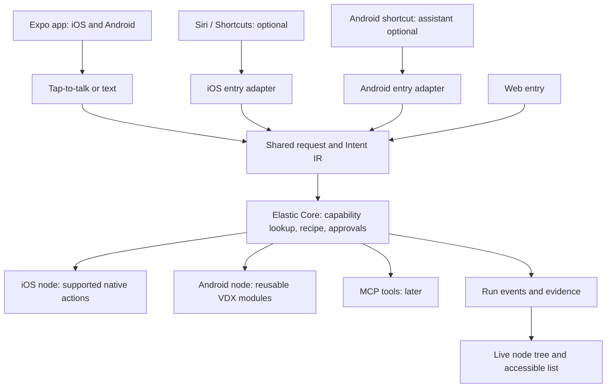

# Elastic: Expo and voice-entry decision

5 October 2026 · Research-backed revision · Supersedes Android-only delivery and mandatory Alexa sequencing in the earlier design and plan

## Decision

Build the mobile application in Expo/React Native with shared TypeScript screens, request contracts, approvals and run presentation for iOS and Android. Use development builds with native Swift/Kotlin modules where necessary. Retain Elastic Core as the shared coordinator and the live node tree as an evidence-based view.

The recommended primary Alexa alternative is Elastic's own foreground tap-to-talk interface. It removes an external assistant from the critical path and supports a consistent product experience on both operating systems. It is not an always-listening smart-speaker replacement. If room-scale voice activation without touching or opening a phone is essential, that remains a separate hardware/assistant integration requirement.

Siri App Intents/App Shortcuts are the recommended additional iOS entry point. On Android, provide ordinary app shortcuts/deep links first and investigate assistant invocation on target devices. Existing Google Assistant App Actions documentation does not establish identical Gemini compatibility. Android AppFunctions is a promising future adapter, but its official documentation describes the API as experimental and Gemini integration as private preview; it is not a launch dependency. Alexa remains an optional integration: official Amazon custom-skill/account-linking documentation exists, so universal unavailability has not been established.

## Options compared

| Option | Strength | Constraint | Decision |
|---|---|---|---|
| Own tap-to-talk voice | Shared interaction, direct access to confirmations and run state | User enters app/activates microphone; speech recognition still needs implementation and availability checks | Primary MVP |
| Siri App Intents/Shortcuts | Supported Apple entry into specific app actions | iOS-only native integration; phrases, unlock and execution limits need testing | First optional system voice driver |
| Android app shortcuts/App Actions | Entry into Android features | Assistant/device/locale support and Gemini behaviour must be validated | Feasibility experiment; shortcuts remain usable without assistant |
| Alexa custom skill | External voice/speaker entry and account linking | Product/account/region eligibility and session constraints require validation | Optional, not release blocker |
| Custom always-on wake word | Potential own invocation experience | Background lifecycle, battery, microphone privacy and platform constraints | Excluded from MVP |

## Updated architecture

Share schemas, state reducers and labels across mobile and web. A complex desktop graph renderer need not be reused unchanged on mobile; the accessible step list is first-class on all surfaces.

## Node tree implementation

The node tree is a required first-release feature on **iOS, Android and web**, with connected capability nodes, live statuses, details and evidence. The Steps list is an accessible alternative, not a substitute for the mobile graph.

See the [complete implementation specification in the design document](Elastic-Design-Document.md#node-tree-implementation--required-in-the-first-release): schemas, APIs, event replay, Expo rendering, interactions, agent packages NT1–NT6 and acceptance tests.

## Shared code versus native code

Shared: navigation, accessible screens, text requests, voice-session UI, clarification, approval presentation, registry client, event subscription, history, error mapping and schema validation.

Native/platform-specific: speech recognition, Siri intents, Android action execution, lifecycle integration, secure credential handling and platform permission differences. Existing Kotlin business/action code should be audited for extraction into an Expo module rather than discarded or copied wholesale. Kotlin UI and AccessibilityService behaviour do not become iOS features through Expo.

Use Expo development builds from the start. Choose a supported stable SDK during the build audit and pin dependencies. Custom native modules/configuration require rebuilt binaries. OTA JavaScript updates cannot add native capabilities missing from the installed binary.

## Voice implementation

1. Accessible microphone button starts an explicit listening session; text remains an alternative.
2. A SpeechInput interface invokes the platform recognizer through an audited integration or local Expo native module.
3. Check permission, language and on-device availability before claiming offline recognition. Do not silently switch to network processing under an offline promise.
4. Transcript enters the shared Intent IR pipeline; uncertain names trigger clarification.
5. Confirmation binds exact action arguments and expires normally.
6. A SpeechOutput interface reads concise results, coordinated with VoiceOver/TalkBack so announcements do not overlap.

expo-speech provides speech output, not recognition. An audio recorder also does not by itself transcribe. The recognizer implementation/library is a spike deliverable, not a dependency already selected or tested. Test quiet/noisy speech, denial of permission, interruptions, Bluetooth routing, physical-iPhone silent mode and the supported languages on both physical platforms. Expo Speech documents an iOS silent-mode limitation; validate audibility with VoiceOver rather than assuming TTS always speaks.

## First cross-platform action

Use the shared intent `call.prepare`, resolved to an explicit platform capability:

- Android: contact selection/lookup, Elastic confirmation, ACTION_DIAL handoff; user presses Call.
- iOS: permitted contact access/selection, Elastic confirmation, supported tel URL handoff; the OS asks for confirmation before dialing.

These experiences are not identical. Neither path establishes call connection. Evidence must identify accepted handoff, observed state where available, user-reported result, failure or uncertainty. Do not label an iOS handoff as an Android dialer-ready state.

Registry entries include platform, permissions, foreground/unlock requirement, available capabilities and completion semantics. The core must reject unsupported actions before execution. Android RobotHand is an Android-specific future capability; iOS offers no general port of that cross-app UI controller in this plan.

Remote requests are queued with expiry and a visible user-resumption path. Do not rely on silent push, a permanent background socket or scheduled background tasks for guaranteed immediate execution. Explicitly test locked, terminated, force-quit, offline and notification-denied states on both platforms.

## Agent team and ownership

The user approved an agent team, not a human hiring plan. The earlier full-time staffing table is historical and does not represent agents hired or running.

| Agent role | Ownership |
|---|---|
| Lead/integration (primary agent) | Architecture, scope, integration, final evidence and user communication |
| Expo client | Shared app, accessibility interactions and mobile run view |
| Core/protocol | Schemas, runtime, approvals, gateway and durable events |
| Native platforms/voice | Swift/Kotlin bridges, VDX reuse, speech and system entry points |
| QA/accessibility/security review | Independent tests, failure cases, permission/identity checks and release findings |

Roles are workstreams, not a promise of simultaneous workers. This environment supports the lead plus up to three concurrent subagents. Schedule implementation waves with explicit file ownership and separate review. Research agents are active for this revision; implementation agents begin with repository audit and the approved build scope. Physical-device access, store credentials, spending and real-user studies still require human resources; agents cannot substitute for those results.

## Revised step-by-step plan

1. **Inventory:** locate existing repositories, current VDX code, native build environment and available iPhone/Android devices. Record reuse and missing inputs.
2. **Platform spikes:** demonstrate microphone-to-transcript, spoken response, contact access and call handoff on both platforms; test Siri entry and Android shortcut/assistant feasibility. Publish a capability matrix.
3. **Expo foundation:** shared app shell, TypeScript contracts, accessible request/approval/step views, development builds for iOS and Android.
4. **Core and simulator:** durable recipe execution, approval binding, registry, replay and controlled failure outcomes. Develop alongside the client after contracts settle.
5. **Real nodes:** secure pairing, platform-native action modules, duplicate suppression and evidence return. Prove the same request on both physical platforms.
6. **Node tree and recovery:** live graphs on iOS, Android and web plus accessible lists, reconnect, expiry, cancellation and honest completion states.
7. **Voice and onboarding:** complete supported-language voice journey, accessibility, permission denial and user recovery on both operating systems.
8. **Optional system entry:** Siri Shortcuts and validated Android entry points feed the same pipeline. Alexa is optional and separately scoped.
9. **Pilot gate:** platform-separated reliability results, VoiceOver/TalkBack review, security checks and compensated target-user sessions before distribution.

Both platforms participate in each milestone. No iOS work is deferred until Android completion. Report pass rates separately so an Android result cannot conceal an iOS failure. The former 10–12-week human-team estimate is withdrawn as an execution commitment; agent elapsed time and dual-platform effort must be re-estimated after code/device spikes. No timing promise should be inferred from number of agents.

## Sources and evidence limits

Research checked 5 October 2026. No physical build, assistant invocation or store eligibility test was performed in preparing this decision.

- [Expo development builds](https://docs.expo.dev/develop/development-builds/introduction/): custom native dependencies require an appropriate native build.
- [Expo Modules API](https://docs.expo.dev/modules/overview/): platform-native functionality can be exposed to shared code.
- [Expo Speech](https://docs.expo.dev/versions/latest/sdk/speech/): text-to-speech output.
- [Expo Contacts](https://docs.expo.dev/versions/latest/sdk/contacts/): iOS and Android contacts access, subject to permissions.
- [Apple App Intents](https://developer.apple.com/documentation/appintents): app actions exposed to Siri and Shortcuts.
- [Apple phone links](https://developer.apple.com/library/archive/featuredarticles/iPhoneURLScheme_Reference/PhoneLinks/PhoneLinks.html): documented tel confirmation behaviour; validate current device UX.
- [Apple URL opening](https://developer.apple.com/documentation/uikit/uiapplication/open(_:options:completionhandler:)): URL handoff result is distinct from action completion.
- [Android App Actions](https://developer.android.com/develop/devices/assistant/overview): Android app-entry framework, not proof of universal assistant compatibility.
- [Amazon custom skill account linking](https://developer.amazon.com/docs/alexaplus/account-linking/account-linking-for-custom-skills.html): official integration documentation exists; this does not establish approval for the intended deployment.

### Additional platform evidence from research agents

- [Apple app sandbox](https://support.apple.com/en-gb/guide/security/sec15bfe098e/web): other-app access is limited to explicitly provided system services.
- [Expo BackgroundTask](https://docs.expo.dev/versions/latest/sdk/background-task/): deferred scheduling, not immediate remote command execution.
- [Android speech recognition](https://developer.android.com/reference/android/speech/SpeechRecognizer): implementation and on-device availability constraints.
- [Android AppFunctions](https://developer.android.com/ai/appfunctions): experimental capability exposure and limited Gemini integration access.
- [Amazon Alexa+ developer FAQ](https://developer.amazon.com/en-US/blogs/alexa/alexa-skills-kit/2025/02/new-alexa-announce-blog): original skills and direct Alexa+ invocation have different availability conditions.
